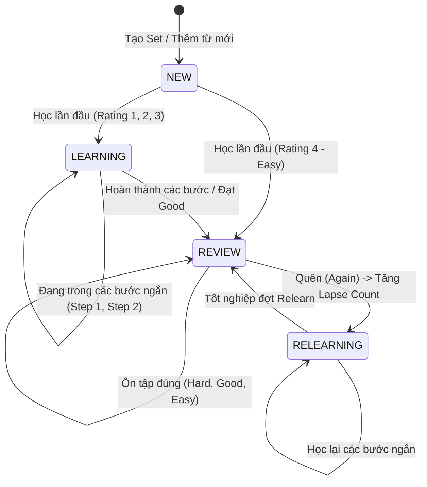

# Báo Cáo & Đặc Tả Kỹ Thuật Hệ Thống Thuật Toán FSRS-6 (Free Spaced Repetition Scheduler v6)
**Dự án:** Ứng dụng Học Từ Vựng Tiếng Anh (VocabLearningApp)  
**Tác giả & Đơn vị:** HUST - Đại học Bách Khoa Hà Nội  

---

## 1. Giới thiệu tổng quan (Executive Summary)

Hệ thống ghi nhớ ngắt quãng của **VocabLearningApp** được xây dựng dựa trên thuật toán hiện đại **FSRS-6 (Free Spaced Repetition Scheduler version 6)**. Khác với thuật toán cổ điển SuperMemo-2 (SM-2 dùng trong Anki cũ vốn chỉ dựa trên quy tắc hàm số mũ đơn giản), FSRS-6 mô phỏng quá trình suy giảm trí nhớ của não bộ dựa trên mô hình ba thành phần trí nhớ (**Three-Component Model of Memory**):

1. **Khả năng gợi nhớ lại (Retrievability - $R$):** Xác suất một người có thể nhớ lại thành công từ vựng tại thời điểm $t$ ngày sau lần ôn tập gần nhất ($0 < R \le 1$).
2. **Độ ổn định của trí nhớ (Stability - $S$):** Khoảng thời gian (tính theo ngày) để xác suất nhớ $R$ giảm từ $100\%$ xuống mức mục tiêu $r$ (mặc định $r = 90\%$).
3. **Độ khó của từ vựng (Difficulty - $D$):** Thang đo độ phức tạp vốn có của từ đối với não bộ người học ($1 \le D \le 10$).

---

## 2. Công thức Toán học & Cơ chế Hoạt động của FSRS-6

Thuật toán FSRS-6 được triển khai trong tệp mã nguồn [`FsrsScheduler.kt`](file:///Users/macbookair/Documents/Huster/Source-Code/VocabLearningApp/app/src/main/java/com/example/vocablearningapp/domain/srs/FsrsScheduler.kt) với bộ 21 tham số chuẩn hóa:

$$\mathbf{W} = [w_0, w_1, w_2, \dots, w_{20}]$$

### 2.1. Đánh giá xếp hạng (Ratings)
Hệ thống chuẩn hóa 4 mức đánh giá:
- **Again ($G = 1$):** Quên hoàn toàn, làm sai.
- **Hard ($G = 2$):** Nhớ khó khăn, mất nhiều thời gian hoặc cần gợi ý.
- **Good ($G = 3$):** Nhớ chuẩn xác trong thời gian phản xạ bình thường.
- **Easy ($G = 4$):** Nhớ tức thì, chính xác 100%.

### 2.2. Khởi tạo thẻ mới (Initial State)
Khi một từ vựng lần đầu tiên được học từ trạng thái `NEW`:
- **Độ ổn định ban đầu ($S_0$):**
  $$S_0(G) = w_{G - 1} \quad (G \in \{1, 2, 3, 4\})$$
- **Độ khó ban đầu ($D_0$):**
  $$D_0(G) = \text{clamp}\left(w_4 - e^{w_5 \cdot (G - 1)} + 1, 1.0, 10.0\right)$$

### 2.3. Đường cong quên lãng (Forgetting Curve & Retrievability)
Tại thời điểm $t$ ngày sau lần học trước với độ ổn định $S$, xác suất nhớ lại $R$ được tính theo định luật lũy thừa (Power Law of Forgetting):
$$R(t, S) = \left(1 + \text{factor} \cdot \frac{t}{S}\right)^{-\frac{1}{w_{20}}}$$
*(Trong đó $\text{factor} = 19/81$ để đảm bảo tại $t = S$ thì $R = 0.9$).*

### 2.4. Cập nhật Độ khó ($D \to D'$)
Mỗi lần ôn tập, độ khó được hiệu chỉnh và có xu hướng hồi quy về giá trị trung bình (Mean Reversion) để tránh việc một từ bị gắn mác quá khó hoặc quá dễ vĩnh viễn:
$$D_{\text{raw}} = D - w_6 \cdot (G - 3)$$
$$D' = \text{clamp}\left(w_7 \cdot D_0(3) + (1 - w_7) \cdot D_{\text{raw}}, 1.0, 10.0\right)$$

### 2.5. Cập nhật Độ ổn định khi Nhớ thành công ($G \ge 2$)
Khi người học trả lời đúng, độ ổn định tăng theo cấp số nhân dựa trên độ khó $D$, độ ổn định hiện tại $S$, và độ suy giảm trí nhớ tại thời điểm kiểm tra $(1 - R)$:
$$S'_{\text{recall}} = S \cdot \left(1 + e^{w_8} \cdot (11 - D) \cdot S^{-w_9} \cdot \left(e^{w_{10} \cdot (1 - R)} - 1\right) \cdot \text{hardPenalty} \cdot \text{easyBonus}\right)$$
- Nếu $G = 2$ (Hard): nhân thêm $\text{hardPenalty} = w_{15}$.
- Nếu $G = 4$ (Easy): nhân thêm $\text{easyBonus} = w_{16}$.

### 2.6. Cập nhật Độ ổn định khi Quên ($G = 1$ - Again)
Khi trả lời sai, độ ổn định bị sụt giảm theo công thức:
$$S'_{\text{forget}} = \text{clamp}\left(w_{11} \cdot D^{-w_{12}} \cdot \left((S + 1)^{w_{13}} - 1\right) \cdot e^{w_{14} \cdot (1 - R)}, 0.1, S\right)$$

### 2.7. Tính toán khoảng cách ngày ôn tập tiếp theo (Interval $I$)
Khoảng cách ngày tới hạn tiếp theo được tính sao cho tại ngày đó, xác suất nhớ của người học vừa chạm ngưỡng mục tiêu $r = 0.9$ ($90\%$):
$$I = \text{round}\left(\frac{S}{\text{factor}} \cdot \left(r^{-w_{20}} - 1\right)\right)$$
*Để chống hiện tượng dồn ứ thẻ ôn tập trong cùng 1 ngày (lumping), hệ thống áp dụng kỹ thuật Fuzzing (dao động ngẫu nhiên $\pm 5\%$ đến $\pm 10\%$).*

---

## 3. Vòng đời Thẻ & Máy trạng thái (State Machine)



---

## 4. Bộ Đánh Giá Đa Yếu Tố Thông Minh (Smart Multi-Factor Evaluator)

Điểm sáng tạo đặc biệt của đồ án là việc **tự động chuyển đổi hành vi tương tác trong các Minigame thành xếp hạng FSRS-6** thông qua [`FsrsRatingEvaluator.kt`](file:///Users/macbookair/Documents/Huster/Source-Code/VocabLearningApp/app/src/main/java/com/example/vocablearningapp/domain/srs/FsrsRatingEvaluator.kt).

Thay vì chỉ gán điểm nhị phân Đúng $\to$ Good, Sai $\to$ Again, hệ thống đo lường 4 chiều dữ liệu:
1. **Độ chính xác (Accuracy):** Đúng ngay lần đầu hay phải qua nhiều lần thử (`attemptCount`).
2. **Thời gian phản xạ (Response Latency):** Phản xạ tức thì (< 2s) thể hiện trí nhớ sâu, trong khi chần chừ (> 6s) thể hiện liên kết nơ-ron còn yếu.
3. **Mức độ hỗ trợ (Hint Usage):** Người học có phải mở gợi ý ký tự/IPA hay không.
4. **Tải nhận thức theo dạng bài (Cognitive Load Weight):** Điền từ chính tả và ghép câu đòi hỏi Active Recall mức độ cao hơn so với Flashcard thụ động.

### Bảng Ma Trận Quy Đổi Hành Vi Game $\to$ FSRS Rating:

| Chế độ Game | Mức Again ($G=1$) | Mức Hard ($G=2$) | Mức Good ($G=3$) | Mức Easy ($G=4$) |
|---|---|---|---|---|
| **1. Flashcard** (Lật thẻ) | Bấm nút *Again* | Bấm nút *Hard* | Bấm nút *Good* | Bấm nút *Easy* |
| **2. Learn** (Trắc nghiệm 4 đáp án) | Chọn sai đáp án | Chọn đúng nhưng mất $> 6.0\text{s}$ | Chọn đúng trong $2.5\text{s} - 6.0\text{s}$ | Chọn đúng tức thì $< 2.5\text{s}$ |
| **3. Quiz** (Đúng / Sai) | Chọn sai | Chọn đúng nhưng mất $> 5.0\text{s}$ | Chọn đúng trong $2.0\text{s} - 5.0\text{s}$ | Chọn đúng tức thì $< 2.0\text{s}$ |
| **4. Match** (Ghép cặp Từ - Nghĩa) | Ghép nhầm cặp | Ghép đúng nhưng mất $> 7.0\text{s}$ | Ghép đúng trong $3.0\text{s} - 7.0\text{s}$ | Ghép đúng nhanh $< 3.0\text{s}$ |
| **5. Fill in the Blank** (Điền từ khuyết) | Gõ sai $> 1$ lần hoặc xem đáp án | Gõ đúng nhưng dùng Hint 💡 hoặc mất $> 12\text{s}$ | Gõ đúng không gợi ý trong $5\text{s} - 12\text{s}$ | Gõ đúng chính xác cực nhanh $< 5.0\text{s}$ |
| **6. Sentence Scramble** (Sắp xếp câu) | Sắp xếp sai $> 1$ lần hoặc bỏ cuộc | Sắp xếp đúng nhưng sửa/undo $> 2$ lần hoặc $> 18\text{s}$ | Sắp xếp đúng mượt mà trong $8\text{s} - 18\text{s}$ | Sắp xếp hoàn hảo $< 8.0\text{s}$ |

---

## 5. Kiến Trúc Lưu Trữ Bền Vững (Database Persistence)

Dữ liệu lịch sử FSRS được lưu trữ cục bộ (Local SQLite) thông qua **Android Jetpack Room**:

```text
Table: vocabulary_items
├── id: TEXT (Primary Key)
├── setId: TEXT (Foreign Key -> vocabulary_sets.id, ON DELETE CASCADE)
├── word: TEXT
├── meaning: TEXT
├── pronunciation: TEXT
├── exampleSentence: TEXT
├── partOfSpeech: TEXT
├── fsrsState: TEXT ("NEW", "LEARNING", "REVIEW", "RELEARNING")
├── fsrsStep: INTEGER (Nullable)
├── stability: REAL (Double)
├── difficulty: REAL (Double)
├── dueAtMillis: INTEGER (Long - Epoch Milliseconds)
├── lastReviewAtMillis: INTEGER (Long - Epoch Milliseconds)
├── scheduledDays: INTEGER
├── reviewCount: INTEGER
└── lapseCount: INTEGER
```

---

## 6. Kết luận & Đánh giá hiệu quả học tập

Mô hình kết hợp giữa **FSRS-6 + Multi-Factor Game Evaluator** mang lại các ưu điểm vượt trội:
1. **Loại bỏ sự nhàm chán:** Người học không chỉ lật thẻ flashcard đơn điệu mà được trải nghiệm 6 trò chơi tương tác đa giác quan (Nghe TTS, Nhìn, Ghép cặp, Điền từ, Lắp ráp câu).
2. **Đo lường năng lực thực tế:** Tốc độ phản xạ và việc chủ động viết đúng câu từ là thước đo chuẩn xác nhất cho mức độ lưu giữ trí nhớ dài hạn (**Long-term Memory Retention**).
3. **Tiết kiệm thời gian:** Những từ đã thuộc làu (Rating Easy) sẽ được dãn cách ôn tập lên đến hàng tuần/hàng tháng, tập trung tối đa thời gian của người học vào những từ hay quên (Lapse).
