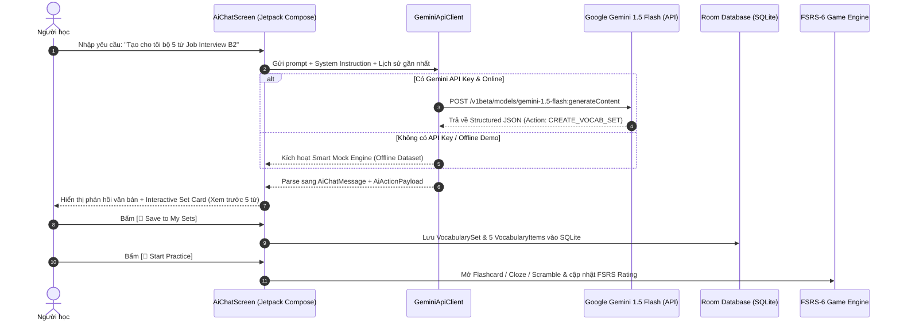

# Đặc Tả Kiến Trúc & Cơ Chế Hoạt Động Của LLM AI Tutor (VocabAI Coach)

> **Tài liệu tham khảo & Báo cáo đồ án:** Giải thích toàn diện về kiến trúc, cơ chế Actionable LLM, giao tiếp API Google Gemini, ánh xạ dữ liệu sang Room Database và tích hợp Spaced Repetition (FSRS-6).

---

## 1. Tổng Quan & Vai Trò Của AI Tutor Trong Hệ Thống

Khác với các chatbot hội thoại đơn thuần chỉ dừng lại ở phản hồi văn bản, **VocabAI Coach** trong **VocabLearningApp** được thiết kế theo mô hình **Actionable AI Agent (Tác tử AI thực thi hành động)**:
- **Hiểu ý định (Intent Recognition):** Tự động nhận diện xem người học đang muốn *hỏi đáp ngữ pháp*, *tra cứu từ vựng* hay *yêu cầu tạo bài học/bộ từ mới*.
- **Tự động sinh thực thể dữ liệu (Data Entity Generation):** Tự động tạo bộ từ gồm đầy đủ: *Từ vựng, Phiên âm IPA chuẩn, Từ loại (Part of Speech), Nghĩa tiếng Việt và Câu ví dụ ngữ cảnh tự nhiên*.
- **Tương tác 1-chạm (1-Tap Interactive Action):** Trả về thẻ xem trước (Interactive Card) ngay trong luồng chat. Người dùng bấm **`[💾 Save to My Sets]`** thì bộ từ lập tức được ghi vào Room Database và sẵn sàng cho toàn bộ 6 chế độ học tập (Flashcards, Learn, Quiz, Match, Cloze, Sentence Scramble) có gắn FSRS-6.



---

## 2. Thiết Kế Structured Action & Function Calling

Để đảm bảo LLM luôn trả về dữ liệu có cấu trúc chính xác cho ứng dụng Android phân tích (parse), hệ thống thiết lập `system_instruction` và tham số `response_mime_type = "application/json"`.

### Cấu Trúc JSON Chuẩn Của Hệ Thống

```json
{
  "message": "Friendly text response to the user in English or Vietnamese",
  "action": "CREATE_VOCAB_SET | NONE",
  "data": {
    "title": "Job Interview Mastery",
    "description": "Essential B2 vocabulary for professional job interviews",
    "level": "B2",
    "category": "Work",
    "words": [
      {
        "word": "competence",
        "ipa": "/ˈkɒmpɪtəns/",
        "partOfSpeech": "noun",
        "meaning": "năng lực; khả năng thành thạo",
        "exampleSentence": "She demonstrated great competence in managing large software projects."
      },
      {
        "word": "negotiate",
        "ipa": "/nɪˈɡəʊʃieɪt/",
        "partOfSpeech": "verb",
        "meaning": "thương lượng, đàm phán",
        "exampleSentence": "He tried to negotiate a higher starting salary during the interview."
      }
    ]
  }
}
```

---

## 3. Kiến Trúc 2 Chế Độ Linh Hoạt (Dual Engine Architecture)

Để đảm bảo **không bao giờ bị gián đoạn hay lỗi kết nối khi đi thi/thuyết trình đồ án**, hệ thống được trang bị 2 chế độ:

| Đặc tính | Chế độ 1: Gemini Live API (Online) | Chế độ 2: Smart Mock Engine (Offline) |
|---|---|---|
| **Mô hình** | Google Gemini 1.5 Flash / Gemini 2.0 Flash | Thuật toán so khớp từ khóa cục bộ |
| **Yêu cầu kết nối** | Cần Internet + Gemini API Key | Hoàn toàn Offline, không cần mạng |
| **Tốc độ phản hồi** | ~1 - 2 giây | Tức thì (< 50ms) |
| **Khả năng sinh từ** | Không giới hạn mọi chủ đề trên thế giới | Các chủ đề demo chuẩn hóa (Interview, Travel, Grammar, FSRS...) |
| **Mục đích** | Trải nghiệm thực tế khi kết nối API Key | Bảo hiểm demo an toàn 100% trước hội đồng |

---

## 4. Tích Hợp Dữ Liệu Với SQLite Room & FSRS-6

Khi người dùng bấm **`[💾 Save to My Sets]`** trong giao diện chat:
1. `AiGeneratedSet` được chuyển đổi thành `VocabularySet` và các `VocabularyItem` với trạng thái ban đầu là `FsrsState.NEW`.
2. `AppViewModel.saveSet()` gọi `VocabularyRepository` thực thi `insertSetWithWords()` trong Room Database.
3. Bộ từ xuất hiện ngay lập tức tại:
   - Danh sách bộ từ ở **Trang chủ (`HomeScreen`)**.
   - Tab **Học tập (`LearnScreen`)** và màn hình chi tiết **`SetDetailScreen`**.
   - Có thể chơi toàn bộ **6 Game**: Flashcards, Multiple Choice, True/False Quiz, Word Match, Điền từ khuyết (Cloze), và Sắp xếp câu (Sentence Scramble).

---

## 5. Hướng Dẫn Lấy API Key & Kích Hoạt Tính Năng AI

### Bước 1: Lấy API Key Miễn Phí từ Google AI Studio
1. Truy cập trang web chính thức: **[https://aistudio.google.com/](https://aistudio.google.com/)**
2. Đăng nhập bằng tài khoản Google cá nhân.
3. Nhấp vào nút **"Get API key"** (hoặc **"Create API key in new project"**).
4. Sao chép (Copy) chuỗi ký tự API Key (dạng `AIzaSy...`).

### Bước 2: Nhập API Key Vào Ứng Dụng
1. Mở ứng dụng **VocabLearningApp** trên điện thoại / máy ảo Android.
2. Tại màn hình chính (Home), bấm vào thẻ **"VocabAI Coach"** (biểu tượng ngôi sao lấp lánh ✨).
3. Bấm vào biểu tượng chiếc chìa khóa **🔑 (API Key Settings)** ở góc trên bên phải thanh tiêu đề.
4. Dán mã API Key vừa sao chép vào ô nhập liệu $\to$ Bấm **`Save Key`**.
5. Huy hiệu ở góc trên sẽ chuyển sang màu xanh lá **"Gemini Live"** $\to$ Bạn đã có thể chat và tạo bộ từ trực tiếp với AI!

> 💡 **Lưu ý:** Nếu không nhập API Key, ứng dụng sẽ tự động chạy ở chế độ **"Demo Mock"**, bạn vẫn có thể thử các câu lệnh mẫu như:
> - `✨ Create B2 Job Interview Set`
> - `🌍 Travel & Tourism Vocab (B1)`
> - `🔍 Explain affect vs effect`
> - `🧠 How does FSRS algorithm work?`
